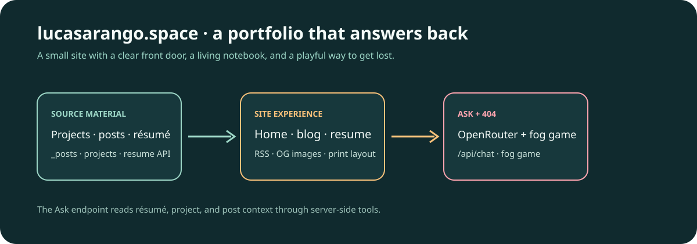

# lucasarango.space

## A portfolio that answers back.

[](https://github.com/aranlucas/lucasarango.space/actions/workflows/check.yml)

[lucasarango.space](https://lucasarango.space) is Lucas Arango’s personal site: a small portfolio, résumé, and blog built with Next.js App Router. Read a project note, skim the résumé, or open **Ask about my work** when you want the site to connect the dots. If you miss a route, the custom 404 turns the detour into a playful WebGL-style fog game.



_A source-level map of the site’s content, visitor routes, and Ask/404 experiences._

## What visitors can do

- Browse selected projects and recent writing on the home page.
- Read posts at `/blog`, subscribe through `/feed.xml`, and use generated Open Graph images for articles.
- View or print the résumé at `/resume`. The page consumes the public JSON Resume generated by the separate private `aranlucas/resume` repository.
- Open the Ask popup from any page to ask about Lucas’s résumé, projects, or writing. The agent can read the Markdown posts through its two server-side tools and streams its reply.
- Explore the “Lost in the fog” game shown when a route is not found.

## Local development

Requirements are Node.js 24 and pnpm 12.6.0 (`packageManager` in `package.json`).

```bash
corepack enable
pnpm install --frozen-lockfile
pnpm dev
```

Open [https://lucasarango.space.localhost](https://lucasarango.space.localhost). `pnpm dev` runs through [Portless](https://github.com/vercel-labs/portless) (a dev dependency); its first run may ask for `sudo` to bind port 443 and trust a local certificate. Draft posts are visible in development and hidden from production routes.

Run the same checks used by CI:

```bash
pnpm check
pnpm build
pnpm start
```

`pnpm check` runs TypeScript, strict Oxlint (including Tailwind and TypeScript-aware rules), formatting checks, and Vitest. The build uses Next’s tracing configuration to include `_posts/**/*.md` for `/api/chat`.

## Optional configuration

The site builds without an AI key, but the Ask popup returns an unavailable response until a provider is configured. For local chat, create `.env.local` with:

```dotenv
OPENROUTER_API_KEY=...
# Optional; defaults to openrouter/free
OPENROUTER_MODEL=openrouter/free
```

The public endpoint caps a conversation at 24 messages and each question at 1,000 characters. The résumé fetch defaults to `https://resume-api.aranlucas.workers.dev`; set `RESUME_API_URL` to another base URL when building against a local or alternate copy.

## WebMCP origin trial

The site includes a public [WebMCP origin-trial registration](https://developer.chrome.com/origintrials/#/registration/442038858738040833) for `https://lucasarango.space`, expiring **March 29, 2027**. Next.js sends its token in the `Origin-Trial` response header, enabling compatible Chrome versions without the testing flag after deployment. The token is intended to be public and is not an authentication credential.

Renew the registration before expiry. Update the default token in `next.config.ts`, or set `WEBMCP_ORIGIN_TRIAL_TOKEN` in the hosting project's build environment and redeploy. Set it to an empty string to omit the header. The token matches only the production origin, so it does not enable localhost, subdomains, or preview deployment origins.

## Writing and content workflow

Add a Markdown file to `_posts/`; the filename becomes the URL slug:

```md
---
title: Post title
date: 2026-09-25
summary: One sentence used in lists, the RSS feed, and link previews.
draft: true
---
```

Keep a filename when changing a published title so links remain stable. The Pages CMS configuration in `.pages.yml` describes the post and archived repository-draft collections.

Post metadata is validated during the build. Titles and summaries must contain text; surrounding whitespace is trimmed. Dates must be real calendar dates in `YYYY-MM-DD` format, quoted or unquoted. When present, `draft` must be the boolean `true` or `false`; quoted strings such as `"true"` are rejected so a typo cannot publish a draft. Validation errors identify the post and field to fix.

## Source map

| Path                                           | Responsibility                                                                                |
| ---------------------------------------------- | --------------------------------------------------------------------------------------------- |
| `src/app/page.tsx`, `src/components/`          | Portfolio home, navigation, project list, posts, résumé UI, Ask popup, and shared components. |
| `src/app/blog/`                                | Blog listing, article routes, and per-article Open Graph images.                              |
| `src/app/resume/`                              | Résumé display and print layout.                                                              |
| `src/app/api/chat/`                            | Validated streaming Ask endpoint and generic public error handling.                           |
| `src/lib/ask-agent.ts`, `src/lib/ask-tools.ts` | OpenRouter agent, résumé/project instructions, and post-reading tools.                        |
| `src/lib/resume.ts`                            | Cached, schema-validated fetch of the public JSON Resume.                                     |
| `src/lib/projects.ts`, `src/lib/site.ts`       | Curated project links and site metadata.                                                      |
| `_posts/`                                      | Published and draft Markdown posts.                                                           |
| `src/components/lost/`                         | 404 exploration game, including scene, controls, and local best score.                        |

## Status and deployment notes

This is a personal site with content and project links maintained in source. The résumé is intentionally edited in the separate `resume` repository; this site reads its public, redacted API output and refreshes the cached copy when that repository calls `/api/revalidate`. The deployment configuration is managed by the hosting project; this repository’s CI verifies the app and build but does not contain a deployment command.
